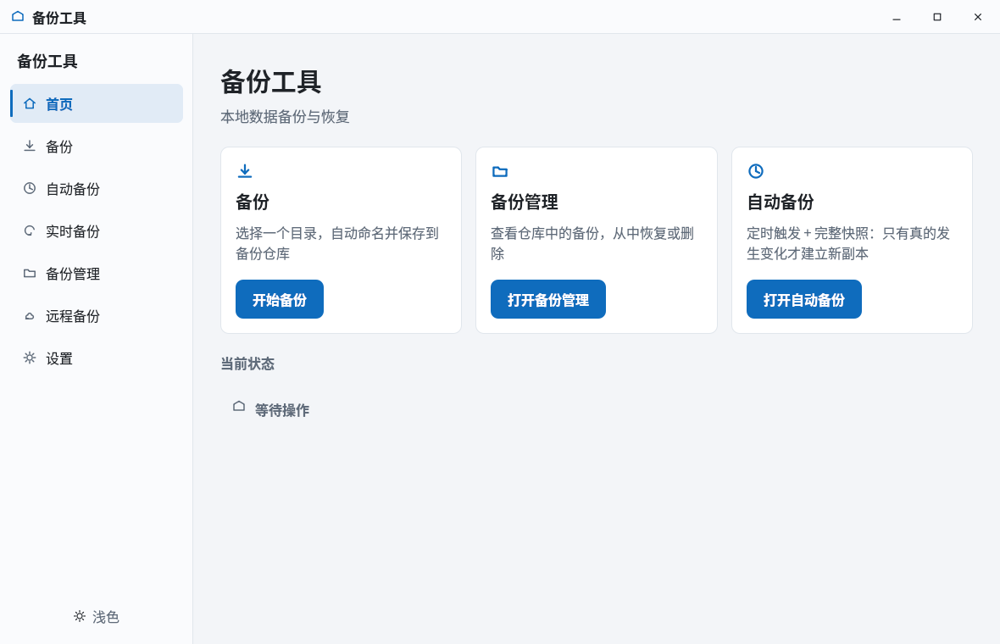
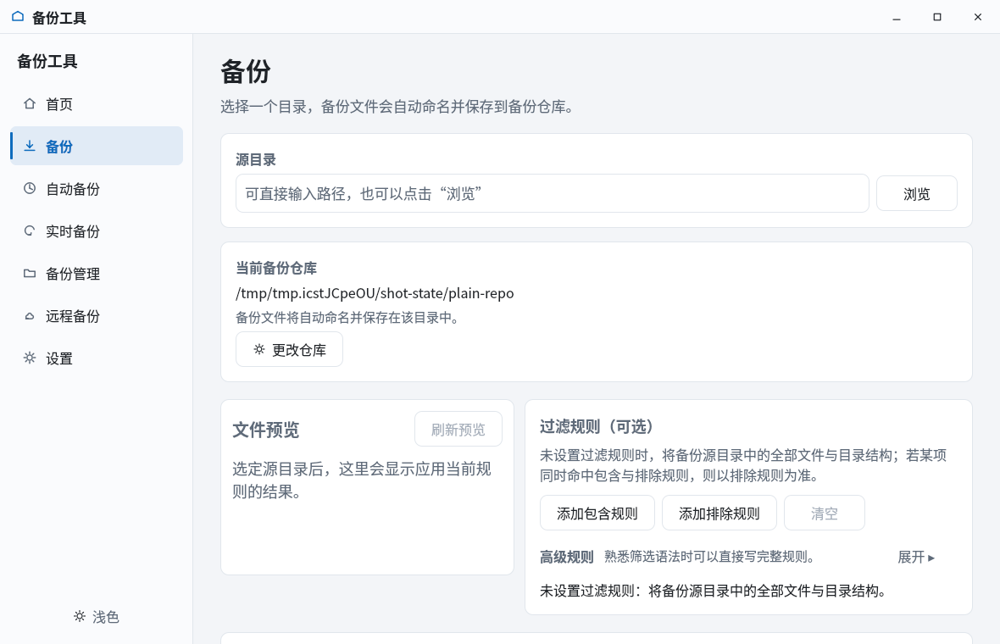
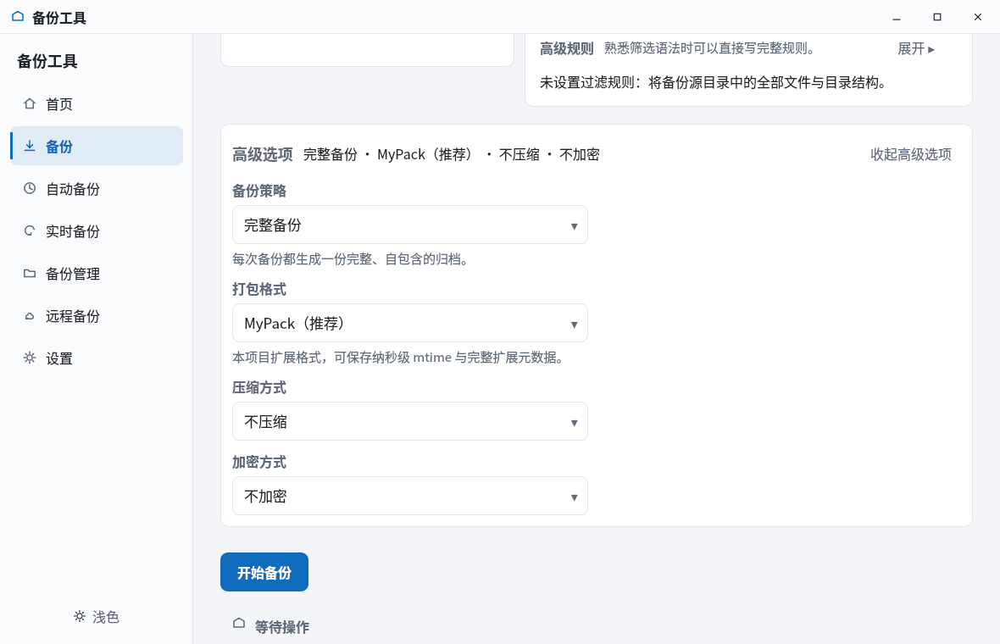
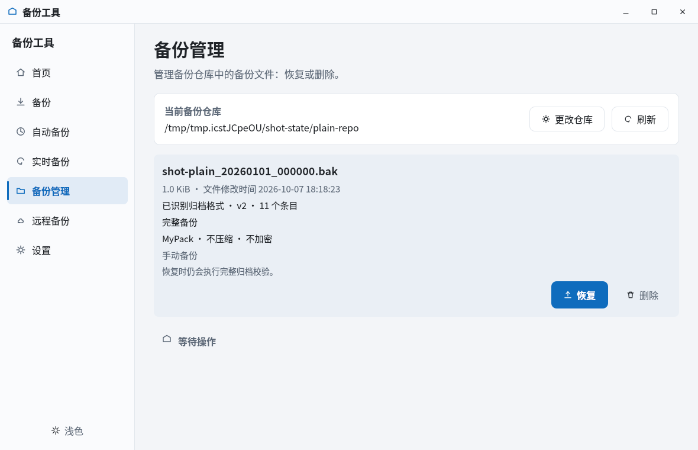
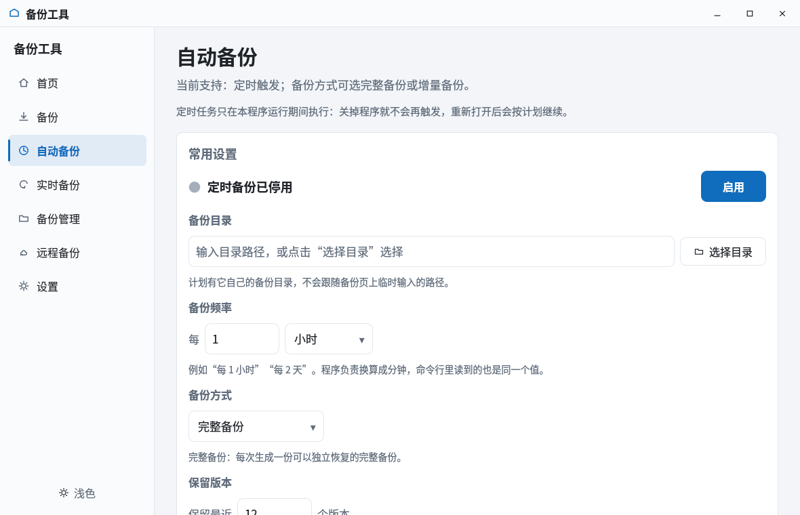
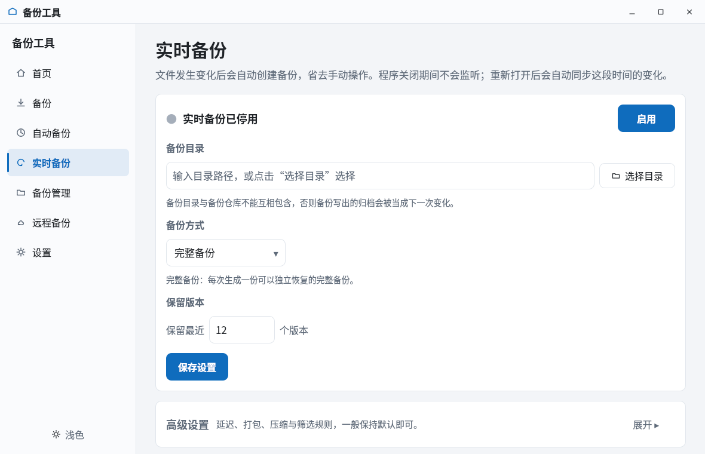
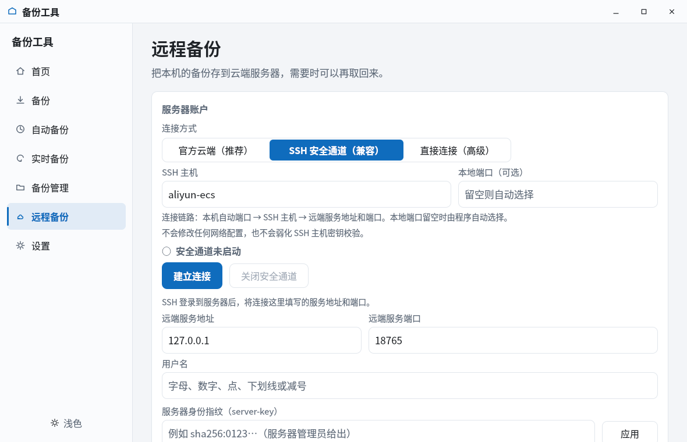
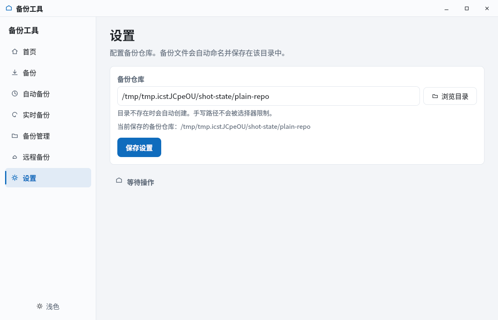

# 现代桌面 GUI（Qt Quick / QML）

> 状态：本项目的正式 GUI。发行包里的图形界面就是它（`bin/backup-gui-modern`）。
> 第一版 Qt 6 Widgets GUI（`build/backup-gui`）只作为回归 / 参考前端保留，
> 见 `docs/ui/desktop_gui.md`。

## 0. 界面预览

七页各一张（浅色主题），取自 GUI 自身的 `--screenshot` 输出；再生成方式见
`docs/images/gui/README.md`。

| 首页 | 手动备份 | 高级选项展开 |
| --- | --- | --- |
|  |  |  |

| 备份管理 | 自动备份 | 实时备份 |
| --- | --- | --- |
|  |  |  |

| 远程备份 | 设置 |  |
| --- | --- | --- |
|  |  |  |

## 1. 定位

- 界面层与 CLI 共用同一份核心：`src/`、`include/`、`app/` 里的业务实现
  一行都没有为 GUI 复制。QML 只负责展示与收集输入，"该不该备份、某个选项
  支不支持、路径合不合法"这些判断全部回到共享核心。
- 发行包（`scripts/stage-client-release.sh`）只装 `backupctl` 与
  `backup-gui-modern` 两个客户端程序，Widgets 版不在发布清单里；它继续可构建，
  并在 `scripts/scheduled_backup_test.sh` 的 K.05..K.07 里作为第三个前端，验证
  同一把应用锁对三个前端都成立。
- 界面层重写时核心一行没动。

## 2. 技术栈

Qt 6.4.2 + Qt Quick + QML + Qt Quick Controls 2（Basic 样式）+ Qt Concurrent +
Qt Network（SSH 安全通道的就绪判定用 `QTcpSocket` / `QTcpServer`，同属
`qt6-base-dev`，没有引入新的系统依赖）。

C++ 侧有 7 个 QObject 桥接类（见第 3 节），文件读写、筛选、增量、调度、协议
全部复用现有的 C++17 核心。

没有引入 Electron、WebView、Python/PySide、GTK，也没有使用任何 Qt 6.5 之后才有的
API：目标机是 Ubuntu 24.04 自带的 Qt 6.4.2，用到 6.5 的写法当场就编不过。

## 3. 文件职责

| 文件 | 职责 |
| --- | --- |
| `ui/modern/main.cpp` | 入口；应用锁、QML 引擎、9 个上下文属性，以及开发期开关（`--smoke-test` / `--screenshot` / `--self-test` / `--remote-acceptance` / `--native-frame` 等，完整清单在文件头） |
| `ui/modern/app_theme.h/.cpp` | `AppTheme`（QObject）：两套调色板 + `QSettings` 记忆（键 `appearance/modern_dark`） |
| `ui/modern/backup_controller.h/.cpp` | `BackupController`（QObject）：配置读写、仓库记录列表、手动备份 / 恢复 / 删除、算法选项与密码校验 |
| `ui/modern/schedule_controller.h/.cpp` | `ScheduleController`（QObject）：自动备份页 ↔ `ScheduledBackupService`；1 秒粒度的 `QTimer` 只负责"醒来问一次"，到没到点仍然问核心 |
| `ui/modern/schedule_frequency.h/.cpp` | "每 N 分钟 / 小时 / 天 / 周"与 `interval_minutes` 的换算（纯 C++，存储 schema 不变） |
| `ui/modern/realtime_controller.h/.cpp` | `RealtimeController`（QObject）：实时备份页 ↔ `RealtimeStore` / inotify watcher / debouncer |
| `ui/modern/remote_controller.h/.cpp` | `RemoteController`（QObject）：远程页 ↔ 与 `backupctl remote` **共用**的 `RemoteArchiveClient`；内部持有 `SshTunnelManager` |
| `ui/modern/ssh_tunnel_manager.h/.cpp` | `SshTunnelManager`（QObject）：GUI 自己启动 / 确认 / 回收 `ssh -N -L` 安全通道 |
| `ui/modern/filter_rule_model.h/.cpp` | `FilterRuleModel`（QObject）：表单 → DSL、校验、后台预览扫描；三个页面各有一份实例 |
| `ui/modern/operation_gate.h/.cpp` | `OperationGate`：进程内"同一时刻只有一个会改动持久状态的业务操作" |
| `ui/modern/dev_harnesses.h/.cpp` | 开发期开关的实现（截图、自检、远程验收）；正常启动一条都不会走到 |
| `ui/modern/resources.qrc` | 把 QML 打进二进制（rcc），运行时不依赖源码目录 |
| `ui/modern/qml/Main.qml` | 窗口骨架：自绘标题栏、侧栏导航、`StackLayout` 七页、主题切换 |
| `ui/modern/qml/pages/*.qml` | 七个页面（第 4 节） |
| `ui/modern/qml/components/*.qml` | 十四个基础件：按钮、卡片、下拉框、图标、输入框、导航项、状态条、分段标签、备份选项面板、备份记录卡片、云端快照卡片、规则卡片、规则编辑器、规则编辑面板 |

## 4. 七个页面

页面编号是跨语言契约：C++ 的 `--screenshot` 与自动化测试按号切页，所以
`Main.qml` 的 `StackLayout` 子项顺序必须与下表一致，新增页面只能追加到末尾。

| # | 页面 | 内容 |
| --- | --- | --- |
| 0 | 首页 | 三张入口卡片（备份 / 备份管理 / 自动备份）+ 当前状态；不显示没有真实来源的统计 |
| 1 | 备份 | 源目录 + 已配置的仓库（界面上没有"归档路径"输入框）；高级选项：备份策略（完整 / 增量）、打包格式、压缩方式、加密方式与密码 / 确认密码；内嵌筛选规则编辑器与预览 |
| 2 | 自动备份 | 启用状态、备份目录、备份频率（每 N 分钟 / 小时 / 天 / 周）、备份方式、保留版本、打包 / 压缩 / 筛选规则；运行状态、运行历史、计划快照 |
| 3 | 备份管理 | 当前仓库里的备份列表（类型、大小、时间、是否加密），从列表发起恢复（加密记录弹密码框）与删除 |
| 4 | 设置 | 备份仓库路径（目前唯一的全局设置）；保存与 `backupctl config repository set` 走同一个控制器方法 |
| 5 | 实时备份 | 启用状态、备份目录、备份方式、保留版本；高级：响应延迟、最长等待、打包、压缩、筛选规则；运行状态、技术细节、最近备份 |
| 6 | 远程备份 | 连接服务器（官方云端 / 自定义走 SSH 通道 / 自定义直连三种身份模式）、远端备份（源目录 + 完整 / 增量）、云端备份列表（原始归档 / 完整备份 / 增量备份，可恢复 / 下载 / 删除）、高级（上传 / 下载原始归档）、退出登录 |

信息分层在自动备份页与实时备份页上刻意保持一致（常用设置 / 高级设置 / 运行状态 /
历史或详情），两个自动化页面用同一套产品语言。

## 5. QML 与 C++ 的接线方式

`main.cpp` 把 9 个对象挂成**上下文属性**：

```cpp
engine.rootContext()->setContextProperty("theme", &theme);
engine.rootContext()->setContextProperty("controller", &backup_controller);
engine.rootContext()->setContextProperty("filterRuleModel", &filter_rule_model);
engine.rootContext()->setContextProperty("scheduleFilterRuleModel", &schedule_filter_rule_model);
engine.rootContext()->setContextProperty("realtimeFilterRuleModel", &realtime_filter_rule_model);
engine.rootContext()->setContextProperty("schedule", &schedule_controller);
engine.rootContext()->setContextProperty("realtime", &realtime_controller);
engine.rootContext()->setContextProperty("remote", &remote_controller);
engine.rootContext()->setContextProperty("useNativeFrame", native_frame);
```

QML 里直接写 `theme.accent` / `controller.busy`，不需要 import 任何自定义模块，
也就不需要维护 qmldir 与单例注册。这个选择是有代价的：qmllint 无法知道这些名字
是什么，会把每一处引用都报成 "Unqualified access"。在 6.4.2 上，qmldir 单例
方案一旦写错，症状是"类型不可用"，排查成本更高；所以这里选了上下文属性，代价是
lint 噪音（处理方式见第 10 节）。

路径参数一律以字符串进出。核心通过 `std::string* error_message` 返回的错误原文
直接显示在界面上，界面不做二次包装、也不吞掉。

## 6. 线程模型与写入闸门

- 每个控制器有自己的 `QFutureWatcher`，任务一律经 `QtConcurrent::run` 提交；
  后台函数只返回值类型结果，不碰任何 QObject / QML 状态。
- 会改动持久状态的本地操作（手动备份 / 恢复 / 删除、计划评估、实时触发）共用
  一把 `OperationGate`：谁先拿到谁持闸，第二个请求被明确拒绝，并把"谁在占着"
  写进状态文案。远程网络 I/O **不占**这把闸——它不改本地仓库的任何持久状态
  （上传只读一个用户选定的 `.bak`，下载写用户指定的新路径）。
- 忙的时候，页面上的输入框与按钮用 `enabled: !xxx.busy` 逐个禁用；
  `scripts/modern_gui_check.sh` 用 grep 计数逐条断言这些绑定存在（数字写在脚本里，
  改界面必须同步改脚本）。
- 空路径这类守卫在启动线程之前就返回，不会往线程池里塞一个注定失败的任务。

## 7. 进度

- 本地备份 / 恢复：核心没有进度回调，所以运行中显示的是一条来回移动的指示条
  （`NumberAnimation on x`），**不给百分比、不给预计剩余时间**。
- 远程上传 / 下载：`RemoteController` 订阅核心的 `RemoteTransferProgress`，
  远程页显示的是真实的已传字节 / 总字节。
- `modern_gui_check.sh` 有一条断言：QML 里不许出现 `percent` / `progressValue` /
  `estimatedSeconds` 这类字段——宁可少显示，也不显示编出来的数字。

## 8. 主题与视觉约束

- 两套调色板集中在 `app_theme.cpp`，QML 里不写死色值，一律引用 `theme.xxx`；
- 用户选择存进 `QSettings`（键 `appearance/modern_dark`），下次启动沿用；
- 图标是 `AppIcon.qml` 里用 Canvas 手绘的线条，不引入图标包、不放 SVG 文件、
  不用 emoji：颜色能跟着主题绑定走，也不增加外部资源；
- 不打包字体，用系统字体；没有 Logo、没有品牌元素；
- 用 `QQuickStyle::setStyle("Basic")` 固定控件样式，避免发行版把 GTK/GNOME 主题
  套到控件上，出现和 Widgets 版互相污染、或"看起来像系统设置面板"的效果；
- 卡片不做阴影：6.4.2 上没有稳定的轻量阴影实现，层次交给底色明度差 + 1px 边框 + 留白。

## 9. 窗口与 Wayland

窗口默认 1180×760，最小 960×620，自绘 40px 标题栏 + 228px 侧栏 + 内容区。
标题栏是无边框窗口，拖动请求交给合成器（`startSystemMove()`），
边缘缩放走 `startSystemResize()`，最小化 / 最大化 / 关闭三个按钮齐全，
双击标题栏切换最大化；最大化按钮的图标会随窗口状态切换。
任务进行中关窗会被拦下，并说明是哪一个操作还在跑。

开发机是 GNOME **Wayland** 会话（没有 XWayland 授权），实测可直接启动。
`--native-frame` 是兜底开关：万一某个合成器上无边框窗口表现不稳，
可以退回系统原生标题栏，界面其余部分不变（窗口标志必须在窗口创建时定下来，
所以由 C++ 决定、QML 只读）。

需要人工确认的部分：拖拽移动与边缘缩放的**指针手势**没法用脚本验证，
必须真的动鼠标。程序化能验证的是"窗口能创建、能切页、能换主题、没有 QML 告警"，
这部分已经覆盖在 `scripts/modern_gui_check.sh` 里。

## 10. 已知限制

- 本地备份 / 恢复没有进度百分比（核心没有回调），也没有中断正在跑的备份的入口；
  远程页的 `cancelRawRestore` 关掉的是"等待输入密码"这一次交互并清掉临时归档，
  不是中断正在跑的传输。
- 连接信息（主机 / 端口 / 服务器身份指纹）与口令只存在于内存：不写
  config.json / schedule.json / realtime.json，不写 QSettings，不进日志与 argv。
- qmllint 6.4.2 会把上下文属性引用报成 "Unqualified access"，
  把 `easing.type`、`Qt.AlignTop` 报成解析失败。这些是工具在 6.4 上的局限，
  所以 `scripts/modern_gui_check.sh` 只把**语法错误**和**未使用导入**当失败，
  其余只统计条数并写进日志。
- 自绘标题栏在极少数合成器上可能有拖拽 / 缩放不跟手的情况，用 `--native-frame` 规避。

## 11. 怎么构建、怎么验证

```bash
# 依赖（Ubuntu 24.04）
sudo apt-get install -y qt6-base-dev qt6-declarative-dev qt6-declarative-dev-tools \
  qml6-module-qtquick qml6-module-qtquick-controls qml6-module-qtquick-layouts \
  qml6-module-qtquick-dialogs qml6-module-qtquick-window qml6-module-qtqml-workerscript

make gui-modern                    # 构建 build/backup-gui-modern
make gui-all                       # 两套 GUI 一起构建（共存，不互相覆盖）
make client                        # 发布用的客户端组合：backupctl + backup-gui-modern
./build/backup-gui-modern          # 正常启动

# 开发期开关
QT_QPA_PLATFORM=offscreen QSG_RHI_BACKEND=software ./build/backup-gui-modern --smoke-test
./build/backup-gui-modern --screenshot tests/output/preview
./build/backup-gui-modern --self-test <源目录> <备份仓库> <恢复目录>
./build/backup-gui-modern --native-frame                      # 退回原生标题栏

./scripts/modern_gui_check.sh      # 构建 + 启动 + qmllint + 静态约束 + 端到端
./scripts/lint.sh                  # C++ 格式检查（含 ui/modern）
```

`--screenshot <目录>` 产出七页 × 两套主题共 14 张 PNG，另外补上备份页高级选项
展开（两套主题）、远程页三种服务器身份模式（各两套主题），仓库里确实存在加密记录
时再补一张恢复密码对话框。截图走窗口自己的 `grabWindow()`，与用户看到的是同一条
渲染路径。

`--smoke-test` 与 `--screenshot` 会把 QML 运行期告警计入退出码：
只要出现一条 QML 告警就以非 0 退出，避免"界面看着正常、日志里其实在报错"。

---

## Filter 可视化规则编辑器（备份页内嵌）

备份页内嵌规则编辑器，宽屏左右两栏、窄屏自动上下堆叠：

- **左栏：文件预览**。列出源目录条目、类型、大小，以及应用当前规则后的归属
  （进入归档 / 被规则排除 / 目录被剪枝）。预览由后台线程扫描，与真实 Backup
  共用同一份遍历（`WalkSourceTree`）：同样的顺序、同样的失败语义，所以
  "预览里看到的"就是"备份会做的"。列表最多显示前 300 个预览条目，超过会分开
  提示"会进入归档的总数"与"列表里显示了多少"（完整执行与备份一致的筛选遍历，
  被排除的目录不进入其子树）；源目录不可用、遍历失败或出现没有被排除的
  socket 时，预览直接给出那句核心原文，而不是列一半假装成功。
- **右栏：规则编辑**。顶部"添加 Include 规则 / 添加 Exclude 规则 / 清空"，
  中间规则卡片列表（摘要、DSL、上移 / 下移 / 删除），下面是编辑表单
  （字段下拉 + 该字段专属控件，不需要记语法），最下面是人类可读摘要、
  只读 DSL 预览与"CLI 等价参数"。

界面只收集表单值与展示结果；DSL 拼装、校验与匹配全部在 C++ 侧完成，与 CLI
共用同一个 Filter。面板不直接访问全局上下文属性，规则模型由所在页面显式注入
（备份页 `ruleModel: filterRuleModel`、自动备份页 `ruleModel:
scheduleFilterRuleModel`、实时备份页 `ruleModel: realtimeFilterRuleModel`）；
面板根读一次 model 后同步到本地属性，子项只绑本地属性 —— 这样避免了 QML
创建顺序导致的运行期空引用告警。

备份页的模型直接挂在 `BackupController` 上（编辑即生效），自动备份页与实时备份页
是"草稿 + 保存"：保存时由页面把规则列表交给各自的控制器。

> 截图位置：用 `./build/backup-gui-modern --screenshot <目录>` 现场产出
> （本仓库不放入伪造截图）。
> 建议内容：Include ext:txt;md 与 Exclude name:secret.txt 同时存在时的左右两栏，
> 以及左侧预览里的 Included / Excluded 标签。

### 规则编辑的当前范围

规则卡片提供上移 / 下移 / 删除；**已有规则暂不支持编辑**，需要修改时删除后重新添加
（字段回填式编辑入口留到后续版本）。规则列表下方始终显示人类可读摘要与只读 DSL，
便于对照当前规则的实际语义。
